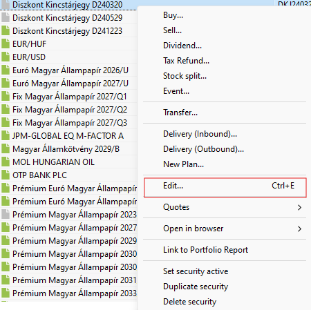
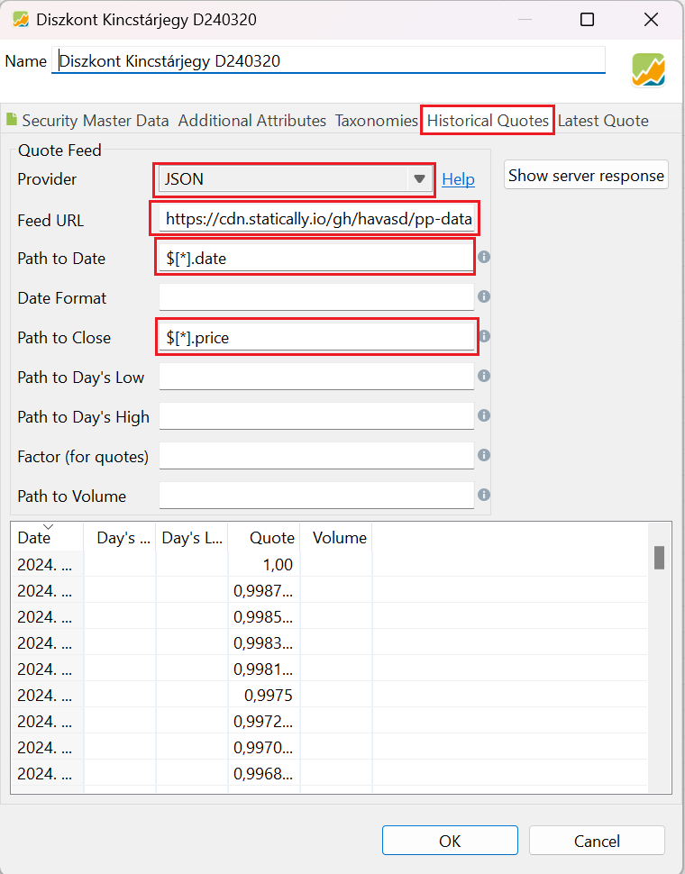

# Historical data for specific hungarian instruments

This repository contains scraped financial information for Hungarian instruments which are either
unlisted or listed by speicific brokers and they don't have common feeds which Portfolio Performance automatically supports.

This data is primarily presented in a format which is compatible with [Portfolio Performance](https://www.portfolio-performance.info/en/).

There are 2 types of data available:
- historical prices
- instrument data in csv format

## Available data

|Data source name                                             | Directory |
| ----------------------------------------------------------- | ----------- |
| [Alfa](https://www.alfanyugdij.hu/arfolyamrajzolo/)         | [alfa_nyugdij](./alfa_nyugdij/) |
| [Allianz](https://www.allianz.hu/hu_HU/penztarak/arfolyamok-hozamok-tkm.html) | [allianz_nyugdij](./allianz_nyugdij) |
| [Aranykor](https://www.aranykornyp.hu/public/arfolyamok)    | [aranykor](./aranykor/) |
| [Bamosz](https://www.bamosz.hu/legfrissebb-adatok)          | [bamosz](./bamosz/)      |
| [Budapest](https://www.mbhbank.hu/onkentes-nyugdijpenztar/nyugdijpenztarak) | [budapest_nyugdij](./budapest_nyugdij/) |
| [Erste](https://www.erstenyugdijpenztar.hu/fooldal)         | [erste_nyugdij](./erste_nyugdij/) |
| [Honved](https://hnyp.hu/arfolyamok)                        | [honved_nyugdij](./honved_nyugdij/) |
| [Horizont](https://horizontmagannyugdijpenztar.hu/arfolyamok) | [horizont_nyugdij](./horizont_nyugdij/) |
| [MÁK](https://www.allampapir.hu/kincstari_arfolyamjegyzes/) | [mak](./mak/) |
| [MBH](https://www.mbhnyp.hu/arfolyamlekerdezes)             | [mbh_nyugdij](./mbh_nyugdij/) |
| [OTP](https://www.otpnyugdij.hu/hu/arfolyamok)              | [otp_nyugdij](./otp_nyugdij/) |
| [Pannónia](https://www.pannonianyp.hu/arfolyamok/)          | [pannonia_nyugdij](./pannonia_nyugdij/) |
| [Szövetség](https://szovetsegnyp.hu/arfolyamok/megtekintes/)| [szovetseg_nyugdij](./szovetseg_nyugdij/) |

## How to use this data in Portfolio Performance

### Importing instruments

This repository provides a CSV file where you all the active instruments are listed grouped by data source. These files are placed under [instruments](./instruments/) directory. You need to download the needed CSV files in order to import them.

This data can be used to import securities straight into Portfolio Performance. [This guide](https://help.portfolio-performance.info/en/reference/file/import/csv-import/#2-securities-import) can help in guiding on how to do it.

### Adding historicalfeed for instrument

1. Right click on your instrument and select `Edit` in the context menu

    

2. Select `Historical Quotes` tab in the pop-up window
    1. Select `JSON` in Provider.
    2. Populate `Feed URL`.

        It is advised to use https://statically.io/ for better caching of data.

        You can populate the URL by some pattern as well: `https://cdn.statically.io/gh/havasd/pp-data/main/<source>/<instrumnet>.json`

        Where `<source>` is a directory in this repository and `instrument` is the name of the file within that directory.
    3. Set `Path to Date` to `$.[*].date` and `Path to Close` to `$.[*].price`
3. This should populate the the table in the popup menu

    

